# AutoJsQ Remote Center

> 基于 [AutoJs6](https://github.com/SuperMonster003/AutoJs6) 深度扩展的 Android 自动化远程管理与调试平台  
> 集设备接入、脚本库管理、任务调度、远程控制、UI 控件分析、AI 辅助调试、Python 插件扩展于一体。

## 项目简介

AutoJsQ 是一个基于 [AutoJs6](https://github.com/SuperMonster003/AutoJs6) 演进而来的三端协同平台，围绕 Android 自动化场景补充了远程中心、Web / Electron 控制台、Go 服务端、AI 调试与插件化能力：

- `web/`：Vue 3 + Electron 控制台，负责设备管理、脚本编辑、任务调度、日志与 AI 助手
- `server/`：Go 服务端，提供 REST API、WebSocket、SQLite 持久化、设备调度与插件运行时
- `AutoJsQ/`：Android 客户端，作为设备侧 Agent 连接远程中心，执行脚本、上报状态并提供远程能力

它适合这些场景：

- 批量 Android 设备统一接入与运维
- 脚本库集中管理、在线编辑、下发执行
- 定时任务与自动化流程编排
- 远程投屏、控制、ADB 调试
- 页面控件树分析与自动化脚本参数留档
- 使用 AI 协助分析 UI、生成思路、调用平台工具进行调试
- 用 Python 插件扩展 HTTP 接口、OCR 能力与自定义调试逻辑

## 核心亮点

- 设备远程中心：支持设备配对、在线状态管理、Agent 通道、ADB 绑定与远程控制
- 脚本库 IDE：支持脚本树管理、Markdown 预览、多文件编辑、推送到设备执行
- 任务调度体系：支持任务中心、定时任务、执行记录、日志中心与变量联动
- UI Inspector：可抓取 Android 控件树，点击控件获取参数并写入 Markdown 文档
- AI 助手：支持绑定设备、附带脚本/插件/控件/文件、工具调用、手动审核与自动审核
- Python 插件系统：支持插件管理、源码编辑、依赖安装、试调用与共享 Python 环境
- Electron 桌面端：支持本地托管服务端、任务栏常驻与桌面化使用

## 架构说明

```text
AutoJsQ/
├── web/         Vue 3 + TypeScript + Naive UI + Monaco + Electron
├── server/      Go + Gin + GORM + SQLite + WebSocket
└── AutoJsQ/     Android 客户端 / 设备侧 Agent
```

### 主要技术栈

- 前端：Vue 3、TypeScript、Vite、Pinia、Vue Router、Naive UI、Monaco Editor、Vditor、ECharts
- 桌面端：Electron
- 后端：Go、Gin、GORM、SQLite、JWT、Gorilla WebSocket
- Android：Kotlin / Java、Gradle Kotlin DSL、Accessibility、Rhino、OpenCV / OCR

## 功能概览

| 模块 | 说明 |
| --- | --- |
| 登录认证 | JWT 登录、会话保持、桌面端本地保存登录态 |
| Dashboard | 展示设备统计、趋势、最近任务、执行记录、日志概览 |
| 设备管理 | 设备列表、状态、分组、ADB 绑定、设备详情、远程控制 |
| 设备调试 | Scrcpy / Agent 镜像、点击控制、音量/电源控制、ADB 调试 |
| 脚本库 | 服务端脚本管理、在线编辑、Markdown 文档、推送运行 |
| UI Inspector | 页面控件树抓取、控件参数提取、Markdown 记录 |
| 任务调度 | 快速任务、定时任务、执行记录、变量联动 |
| 日志中心 | 统一查看任务日志与运行日志 |
| AI 助手 | 绑定设备、附带上下文、调用工具、审批高风险操作 |
| 接口插件 | Python 插件管理、源码编辑、依赖安装、试调用 |
| 文档中心 | API 文档、项目说明、内置帮助文档 |

## 快速开始

### 1. 启动服务端

```bash
cd server
go run ./cmd/server
```

Windows 也可以直接使用：

```bat
cd server
一键启动.bat
```

默认信息：

- 服务地址：`http://localhost:13145`
- Swagger：`http://localhost:13145/swagger/index.html`
- 默认账号：`admin / admin123`

### 2. 启动前端

```bash
cd web
npm install
npm run dev
```

默认访问地址：

- Web 控制台：`http://localhost:5173`

### 3. 启动 Electron 桌面端

```bash
cd web
npm install
npm run electron:dev
```

构建桌面安装包：

```bash
cd web
npm run electron:build
```

### Windows 运行注意事项

- Windows 下使用 Electron 打包版时，建议以管理员身份运行，否则可能无法正常调度本地服务端
- 如果启动后发现服务端无法被桌面端拉起，可右键程序选择“以管理员身份运行”
- 也可以在程序属性中勾选“以管理员身份运行此程序”，避免每次手动确认

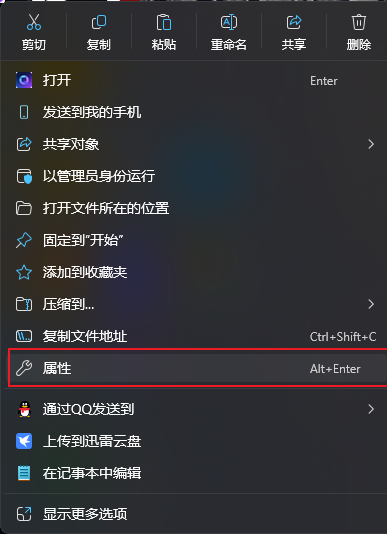

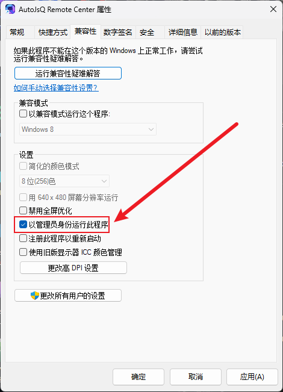

### 4. 接入 Android 设备

1. 在 Web 控制台创建设备配对信息
2. 打开手机端 AutoJsQ 侧栏中的“远程中心”
3. 填写服务器 IP、端口、配对 Token 或设备标识
4. 设备上线后即可在控制台中进行管理、调试、执行脚本

## Docker 部署

后端可直接通过 Docker Compose 启动：

```bash
cd server
docker compose up -d
```

若需要一起拉起前端，可使用 `full` profile：

```bash
cd server
docker compose --profile full up -d
```

默认端口：

- Server：`13145`
- Web：`5173`

## 截图预览

### 登录与总览
- 默认账号：`admin / admin123`

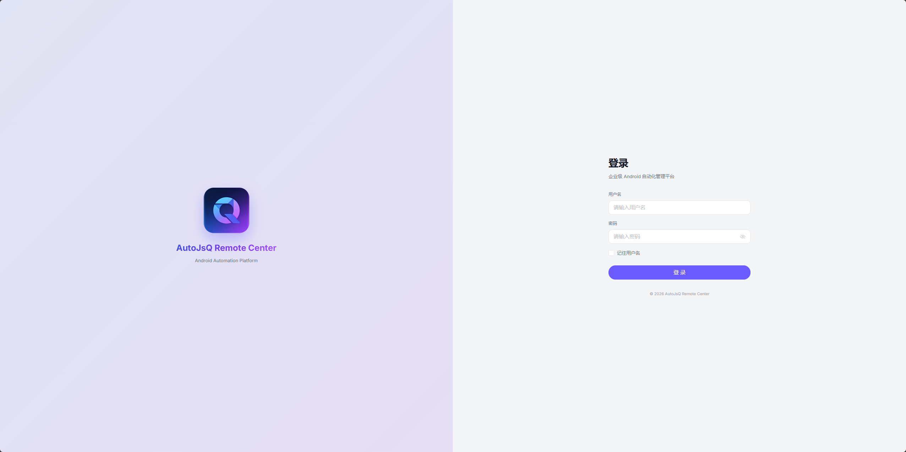

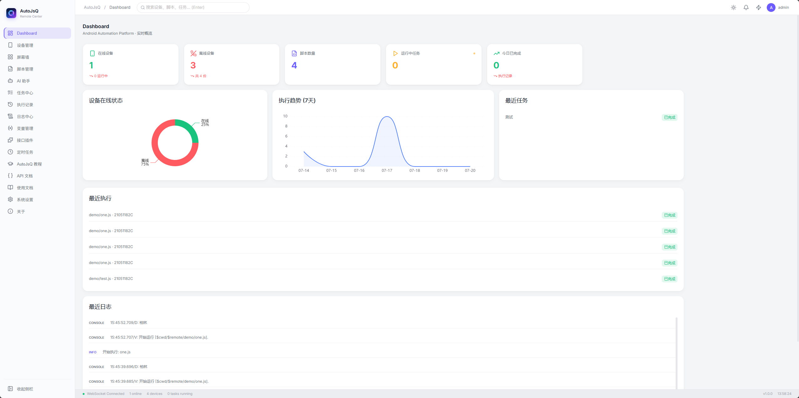

### 设备中心

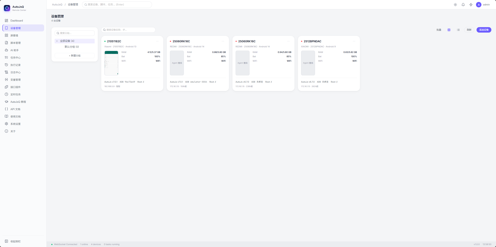

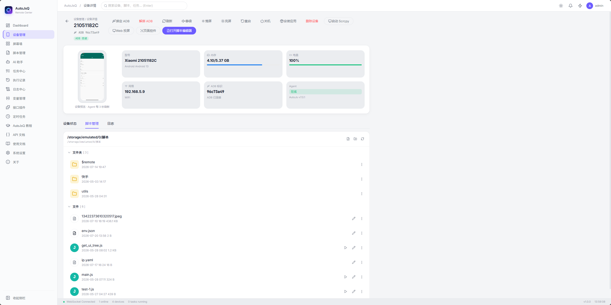

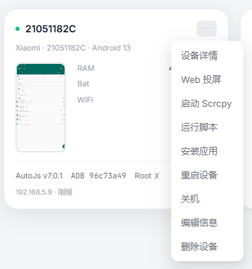

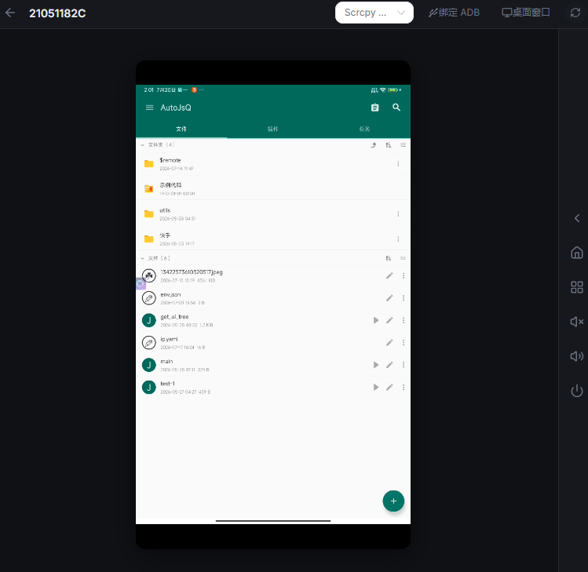

### 脚本与任务

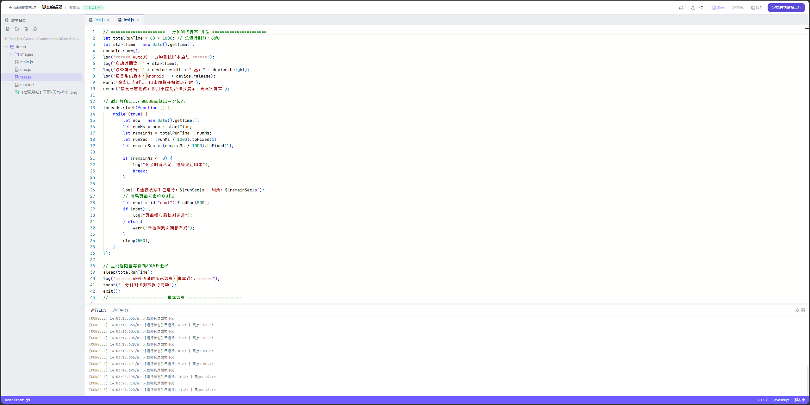

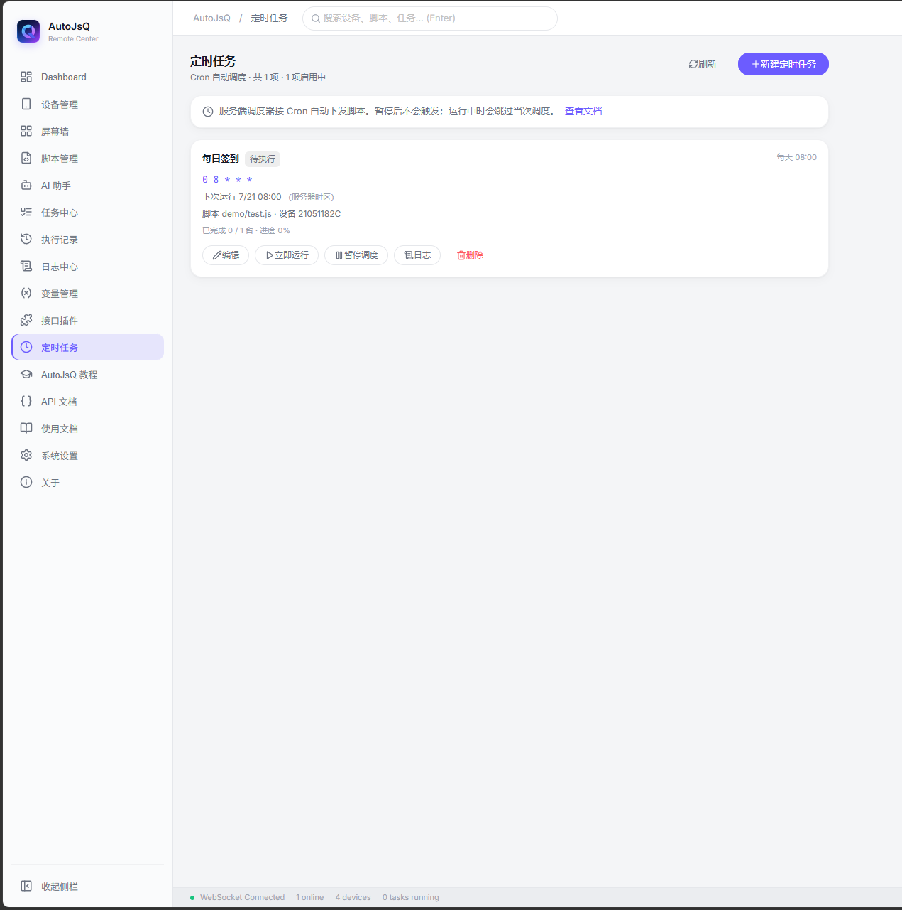

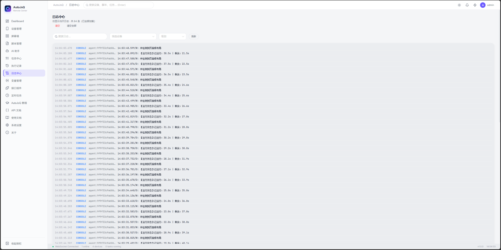

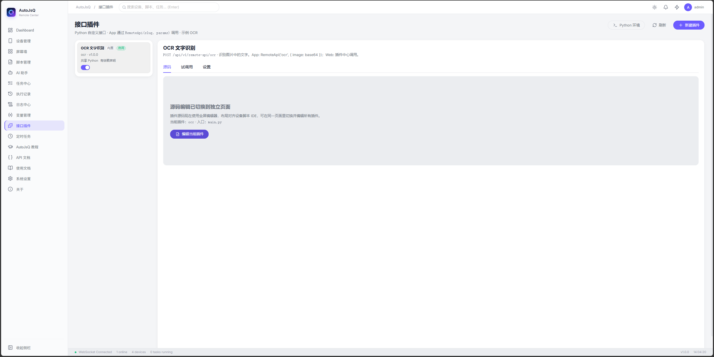

### AI 与设置

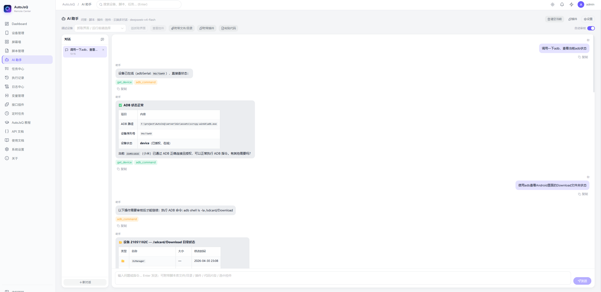

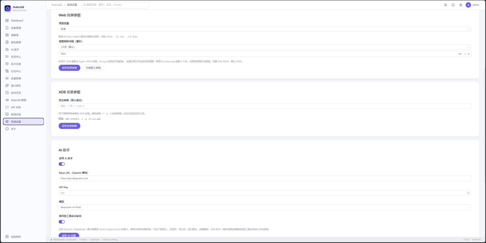

## 仓库结构

```text
AutoJsQ/
├── AutoJsQ/         Android 客户端源码
├── server/          Go 服务端
│   ├── cmd/server/  服务端入口
│   ├── internal/    核心业务实现
│   ├── assets/      scrcpy/adb 等运行资源
│   └── data/        运行时数据库与默认数据
├── web/             Vue 3 / Electron 控制台
│   ├── src/views/   页面模块
│   ├── src/stores/  状态管理
│   ├── electron/    Electron 主进程与桌面集成
│   └── docs/        文档资源
└── github_Docs/     GitHub 展示文档与截图
```


## 相关目录

- Web 控制台说明：`web/README.md`
- Server 说明：`server/README.md`
- Android 客户端源码：`AutoJsQ/`
- GitHub 展示截图：`github_Docs/dist/`

## 相关链接

- AutoJs6 项目来源：[SuperMonster003/AutoJs6](https://github.com/SuperMonster003/AutoJs6)
- 百度网盘下载：[AutoJsQ](https://pan.baidu.com/s/5ErlVHfsOKJsmNP8NsKVkhA)
- 博主主页：[哔哩哔哩 @519965290](https://space.bilibili.com/519965290)

## 说明

- 百度网盘资源说明：`通过网盘分享的知识：AutoJsQ`
- 若后续网盘链接失效，建议在仓库说明或博主主页同步更新下载地址
